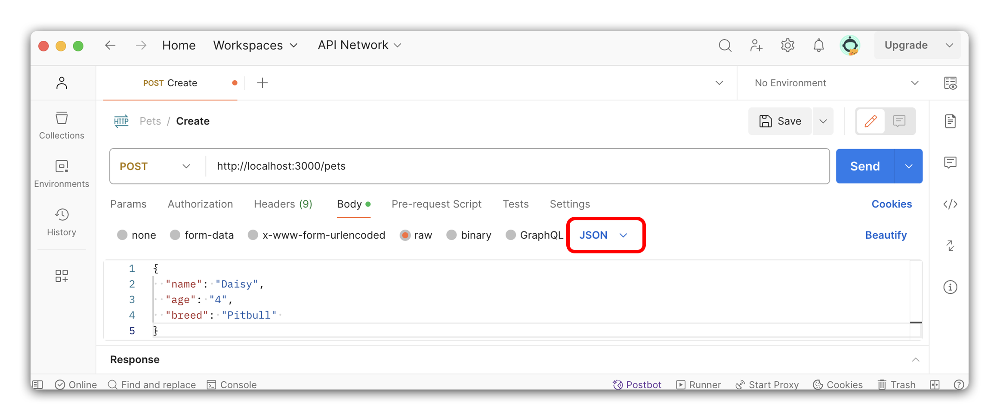

# 

**Learning objective:** By the end of this lesson, students will be able to create a new pet by POSTing to the database and sending a JSON response to the client.

## CREATE - Create route

In this section, we will make a new route to create a new pet. This route will be a `POST` request to `/pets`, and will return a JSON response with the created pet.

We will be following these specs when building the route:

- CRUD Action: CREATE
- Method: `POST`
- Path: `/pets`
- Response: JSON
- Success Status Code: `201` Created
- Success Response Body: A new Pet object
- Error Status Code: `500` Internal Server Error
- Error Response Body: A JSON object with an error key and a message describing the error

## Creating a POST route

The purpose of this route is to handle data that is sent along with a form submission. Before we can start writing the route and controller function, we need to make a few additions to our existing code. In `server.js`, let's import the `pets` router file and add it to our `/pets` route.

```js
// server.js

const dotenv = require('dotenv');
dotenv.config();
const express = require('express');
const app = express();
const mongoose = require('mongoose');

// Import the controller file
const petRouter = require('./controllers/pets.js');

mongoose.connect(process.env.MONGODB_URI);

mongoose.connection.on('connected', () => {
  console.log(`Connected to MongoDB ${mongoose.connection.name}.`);
});

app.use(express.json());

// Add the petRouter to the `/pets` route
app.use('/pets', petRouter);

app.listen(3000, () => {
  console.log('The express app is ready!');
});
```

Great, now all of our routes can be handled in `controllers/pets.js`!

Just one more step - we need to import `express` so that we can make use of express methods:

```js
// controllers/pets.js

// Add these at the top of the file:
const express = require('express');
const router = express.Router();

const Pet = require('../models/pet.js');
```

## Define the route

Now we're finally ready to define a route. Use the `.post()` method on the router object to create the route and pass in the path and a callback function.

```js
// controllers/pets.js

// CREATE - POST - /pets
router.post('/', async (req, res) => {});
```

We are using `async` at the start of the callback function to allow us to use `await` inside of the function. This will enable us to asynchronously query the database for all pets.

> 🧠 Notice how we have declared this path. We have just used `/` as the path. This is because we are already in the /pets route. This is a shorthand way of declaring the path. Check out `server.js` to see how we have declared the `/pets` route.

## Test the Route

Let's test the route to ensure that it works - we can do this by sending a response with a message to the client.

```js
// controllers/pets.js

// CREATE - POST - /pets
router.post('/', async (req, res) => {
  // Add a message to test the route
  res.json({ message: 'Create Route' });
});
```

Open Postman and send a POST request to `http://localhost:3000/pets`. You should receive a JSON response with the message Create Route. If you do not receive this message, debug before moving on.

> 📚 If you are having trouble, check the terminal for error messages. Sometimes, the issue is simply that the server is not running.

## Making a post request

The route works, but now we want to actually make use of it being a `POST` route! We'll want to wrap our code in a `try...catch` block to handle any errors that may occur.

### Try - Create a new pet

Inside our controller function, we'll call `create()` on our `Pet` model, and pass in `req.body`. Once the `createdPet` is created, we'll send a JSON response with the new `createdPet` object.

```js
// controllers/pets.js

// CREATE - POST - /pets
router.post('/', async (req, res) => {
  try {
    // Create a new pet with the data from req.body
    const createdPet = await Pet.create(req.body);
    res.status(201).json(createdPet); // 201 Created
  } catch (error) {
    // Setup for error handling
  }
});
```

Be sure to include a status of `201 Created` with your json response body.

### Catch - errors

Errors can occur in several places when querying the database. We need to handle these errors and send a response to the client that is easy to read and understand. Luckily, we have already set up a catch block in the `try...catch` statement. We can use this to catch any errors that might happen:

```js
// controllers/pets.js

// CREATE - POST - /pets
router.post('/', async (req, res) => {
  try {
    const createdPet = await Pet.create(req.body);
    res.status(201).json(createdPet);
  } catch (error) {
    res.status(500).json({ error: error.message });
  }
});
```

Inside the `error` object there is a property called `message`. This is a string that describes the error that has occurred. We can use this to send a meaningful response to the client. Include a `500` status to indicate that there was an internal error on the server side.

> The error object is an instance of the built-in Error class in JavaScript. It has many valuable properties, one of them being message. For a complete list of Error capabilities, check out the [MDN Web Docs](https://developer.mozilla.org/en-US/docs/Web/JavaScript/Reference/Global_Objects/Error).

## 🎓 You Do: Test the create route with Postman

Now that we have finished the route let's test it with Postman. We'll do this by sending a `POST` request to `http://localhost:3000/pets`. Recall that our pet schema has the following specifications:

```js
const petSchema = mongoose.Schema({
  name: {
    type: String,
    required: true,
  },
  age: {
    type: Number,
    min: 0,
  },
  breed: String,
});
```

Under the `Body` header, select `raw` and make sure the blue colored dropdown to the right is set to `JSON`.



Your values will be different, but an example body would look something like this:

```json
{
  "name": "Daisy",
  "age": "4",
  "breed": "Pitbull"
}
```

Once you have composed the `body`, send a `POST` request to `http://localhost:3000/pets`. Test both success and error messages.

- Success: You should receive a JSON response with the new pet object!
- Error: You should receive a JSON response with an error message - most likely, that the `create()` failed due to bad form data. This message should describe the error that has occurred.
