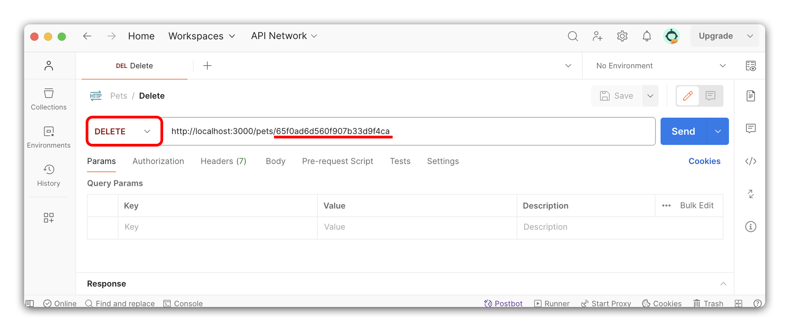
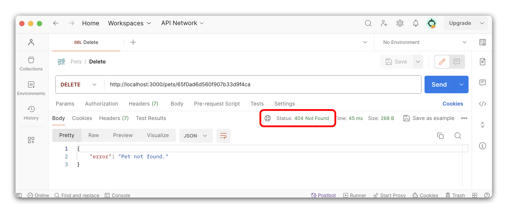
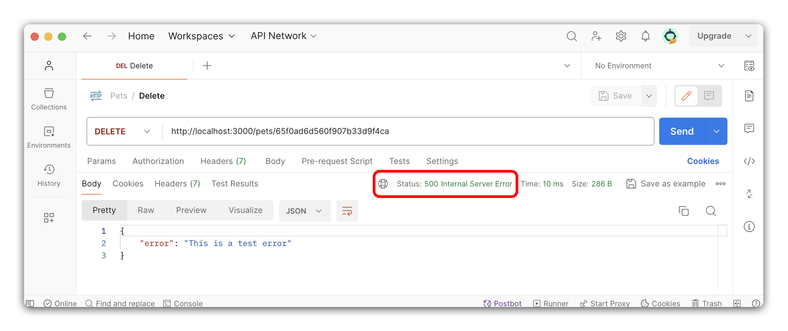

# 

**Learning objective:** By the end of this lesson, students will be able to create a route that deletes a single pet from the database and sends a confirmation as a JSON response to the client.

## DELETE - Delete Route

In this section, we will create a new route to delete a single pet. This route will be a `DELETE` request to `/pets/:petId`, returning a JSON response with the deleted pet.

We will be following these specs when building the route:

- **CRUD Action:** DELETE
- **Method:** `DELETE`
- **Path:** `/pets/:petId`
- **Response:** JSON
- **Success Status Code:** `200` Ok
- **Success Response Body:** A JSON object with the deleted pet.
- **Error Status Code:** `404` Note Found || `500` Internal Server Error
- **Error Response Body:** A JSON object with an `error` key and a message describing the error.

## 🎓 You do: Create a DELETE route

Create a new route to delete a single pet. Using the above specs, create a new route to delete a single pet from the database.

💡 Hints:

- Use the `req.params` object to access the `id` parameter from the path.
- Use the `.findByIdAndDelete()` method on the `Pet` model to delete a single pet from the database.
- You will need a `try...catch` block to handle any errors that may occur.
- You should handle a `404` status code if the pet is not in the database. Refer to the show route to see how to handle this.
- Send the deleted pet object in a JSON response. Attach a [`200`](https://developer.mozilla.org/en-US/docs/Web/HTTP/Methods/DELETE#responses) status code, as you've done previously.  
- Make sure to set the status code to `500` and send an error message for any non `404` errors that occur.

## Test the delete route with Postman

Once you have created the route, test it to ensure it works. We'll do this by sending a `DELETE` request to the route using Postman.

Open Postman and create a new request with the following details:

- Use the drop-down menu to select `DELETE` as the method.
- Enter the URL `http://localhost:3000/pets/<petId>` in the address bar, where `<petId>` is a valid pet id that exists in your database. If you need to create some more pets, use the `Create Route` we built earlier to add them to the database.
- Click the `Send` button to send the request.



### Test for success

After you have sent the request, you should receive a status code of `200` with the deleted pet object in the response. This means the pet was successfully deleted from the database.

### Test for error

Let's test for an error. Send another `DELETE` request to the route, but this time use an `id` that does not exist in the database. Since we have just deleted a pet, we can use the same request again without changing anything to test for our `404` status code and error message.



We can test the `500` status code by throwing a new error in the route. Let's add a new line of code to throw a new error in the route and test the route again:

```js
// controllers/pets.js

// DELETE - DELETE - /pets/:petId
router.delete('/:petId', async (req, res) => {
  try {
    throw new Error('This is a test error'); // Add this temporary code
    // Try block
  } catch (error) {
    // Catch block
  }
});
```

Send a `DELETE` request to the route, and you should receive a status code of `500` with an error message in the response.



If you encounter something different during the testing process, debug before moving on. Remember to remove the line of code that throws the error when you're done with testing!
