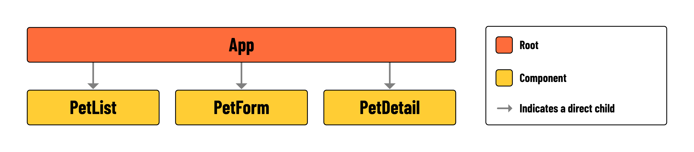

# 

**Learning Objective**: By the end of this lesson, the learner will understand the minimum requirements and component hierarchy for the application.

## Introduction

In this lesson, you'll be building a Single Page Application (SPA) using React. You will also be using `fetch` to consume from a previously built RESTful API. You will be able to Create, Read, Update, and Delete (CRUD) pets from the API, and conditionally render the UI based on the state of the application.

## Minimum Requirements

| Feature               | Requirements                                                                                                         |
| --------------------- | -------------------------------------------------------------------------------------------------------------------- |
| **Read all Pets**     | - Display all Pets in the UI                                                                                           |
| **Read a single Pet** | - Add a link to view the details of a single Pet - Conditionally render the details of a single Pet               |
| **Create a new Pet**  | - Conditionally render a form to create a new Pet - Handle the form submission - Display the new Pet in the UI |
| **Update a Pet**      | - Conditionally render a form to update a Pet - Handle the form submission - Display the updated Pet in the UI |
| **Delete a Pet**      | - Add a button to delete a Pet - Remove the Pet from the UI                                                       |

## Component Hierarchy

This lesson does not feature any routing, meaning that the user will not be navigating between pages in this build. When working with React, however, this doesn't mean that you are limited to the use of a single component - far from it! Your single 'page' will be made up of multiple components, so it's still a good idea to map out the component hierarchy and get an overview of the app layout before you start coding:

The page will have a layout similar to a dashboard. Different sections will show or hide components depending on what's needed at the time. This means parts of the page can change based on user actions or other factors, keeping the display relevant and interactive.