# 

Note: While most browsers offer a version of DevTools, this guide is specifically for Google Chrome's DevTools. 

## What are DevTools?

Chrome DevTools are a set of built-in debugging and inspection tools for webpages within the Google Chrome browser. They provide functionalities for examining the structure, behavior, and performance of webpages, allowing developers to identify and solve issues, optimize resource usage, and experiment with different configurations.

### Navigating the Devtools

- **Elements Panel**: Examine the Document Object Model (DOM) structure of a webpage, including HTML elements, their attributes, and CSS styles. This allows for real-time modification of styles and visual debugging of layout issues.

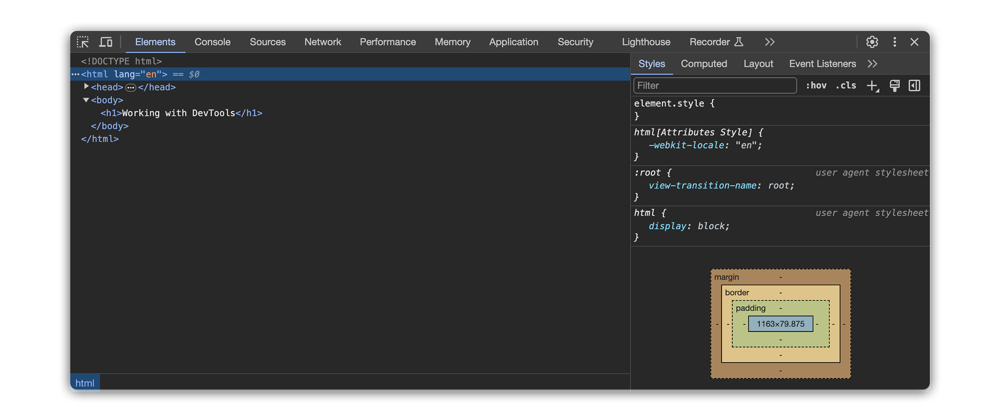

- **Console Panel**: Execute JavaScript code in the browser context, allowing for testing logic, debugging scripts, and manipulating webpage elements dynamically.

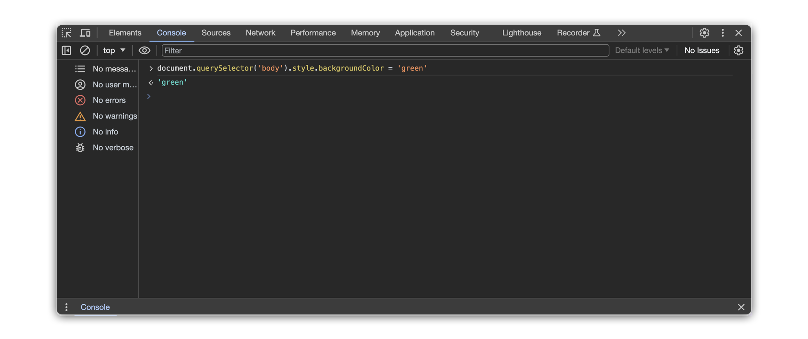

- **Sources Panel**: Inspect and debug JavaScript source code files associated with the webpage, including setting breakpoints, stepping through code execution, and examining variable values.

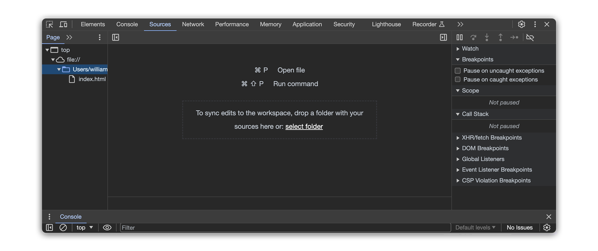

- **Network Analysis**: Monitor network requests and responses made by the webpage, including details like timestamps, status codes, and transferred data. This helps identify performance bottlenecks and diagnose network-related issues.

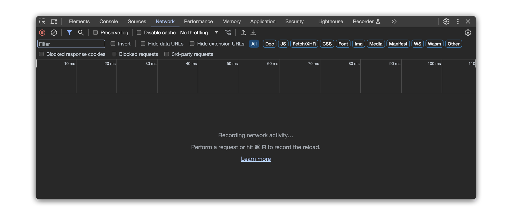

- **Performance Panel**: Analyze the webpage's performance by recording and visualizing resource usage and execution timelines. This helps identify performance bottlenecks and optimize resource allocation.

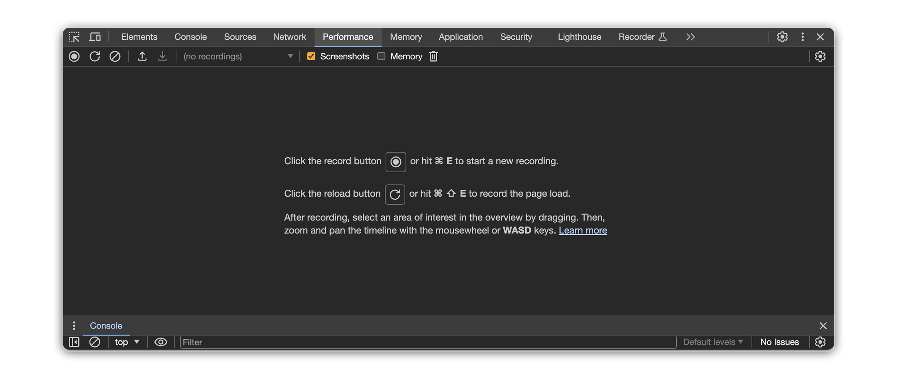

- **Additional Tools**: Various other tools are available depending on the webpage and browser version, such as the **Application panel** for inspecting storage mechanisms, the **Security panel** for analyzing security certificates, and the **Recorder panel** for capturing user interactions for playback and analysis.

## Accessing DevTools

There are two ways to access DevTools:

- **Right-click anywhere on a webpage:** Choose "Inspect" from the menu that pops up. This opens the DevTools panel, revealing a wealth of information about the page.

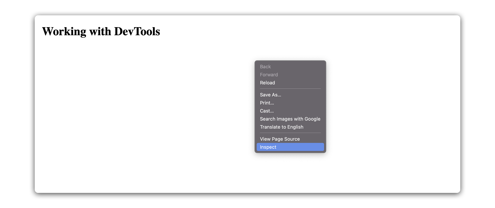

- **Keyboard shortcuts:** For power users, Chrome offers quick access with keyboard shortcuts like `Ctrl+Shift+I` (Windows/Linux) or `Command+Option+I` (Mac).

## Exploring the `Elements` panel

The elements panel, often referred to as the "Inspector," provides a visual representation of the HTML and CSS of a webpage. 

**Here, developers are able to:**

- **Inspect and modify HTML elements**: Developers can select and inspect individual elements, view their attributes and styles, and make real-time modifications to the page's structure and appearance.

- **Navigate the Document Object Model (DOM)**: The panel displays the hierarchical structure of the webpage's elements, showing how they are nested and organized.
  - **Expand and collapse branches**: Click on element nodes to expand their children and reveal their sub-structure.

  - **Filter elements**: Apply filters based on element type, class, ID, or other attributes to focus on specific parts of the DOM.

- **View all CSS styles on a page**: Developers can view and modify the styles applied to elements, including inherited and computed styles, and experiment with different visual presentations.
  - **Experiment with new styles**: Test different visual designs, colors, and layouts by modifying CSS properties and observing the real-time changes on the webpage.

- **Debug layout issues**: Identify and fix visual inconsistencies, layout problems, and overlapping elements by inspecting and modifying the HTML and CSS.

### Searching for elements

A search bar located at the bottom of the panel allows developers to find specific elements based on:

- **Tag name**: Search for all elements of a specific HTML tag (e.g., div, img).

- **Attribute value**: Locate elements with specific values for attributes like `ID` or `class` (e.g., `id="banner"`).

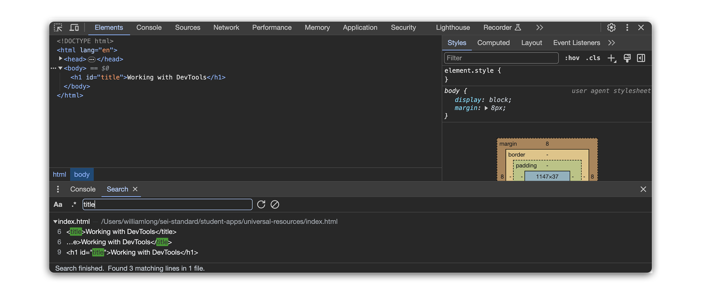

### `Select Element` tool

In Chrome DevTools, the "Select Element" tool, officially referred to as the **Inspect Icon**, is symbolized by an icon that looks like a cursor arrow. Located in the top left corner of the DevTools window, this tool enables you to click on and directly inspect elements within a webpage.

**Developers use it to:**

- **Hover over elements on the webpage**: This highlights the corresponding node in the DOM tree, establishing a visual link between the page and its code.

- **Click hovered elements**: Access context menus for inspecting attributes, editing styles, or performing other actions on the selected element.

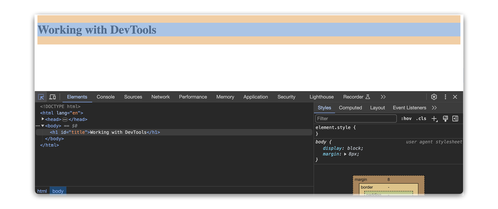

## Working in the Console

The Console panel within Chrome DevTools acts as a powerful interpreter and interactive workspace for JavaScript within the context of a webpage. 

**It allows developers to:**

- **Execute JavaScript commands**: Send commands directly to the browser to evaluate expressions, run functions, and interact with webpage elements dynamically. 

- **Enter commands directly in the input field**: The console interprets plain JavaScript code, allowing immediate evaluation and interaction with the webpage.

- **Access webpage objects**: Use JavaScript operators and functions to interact with DOM elements, manipulate the page, and explore object properties. 

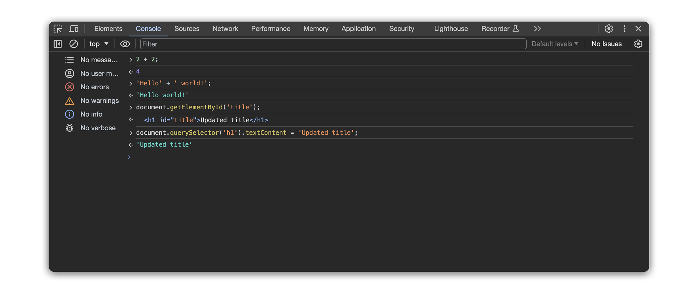

- **Monitor output**: The console displays the results of executed commands, including log messages, errors, and returned values, providing insight into JavaScript execution and webpage behavior. 

- **Log messages**: Utilize logging functions like `console.log()` to output information and track the execution flow of your code.

- **Debug JavaScript**: Set breakpoints in code to pause execution at specific points, examine variable values, and step through code line by line for detailed analysis.

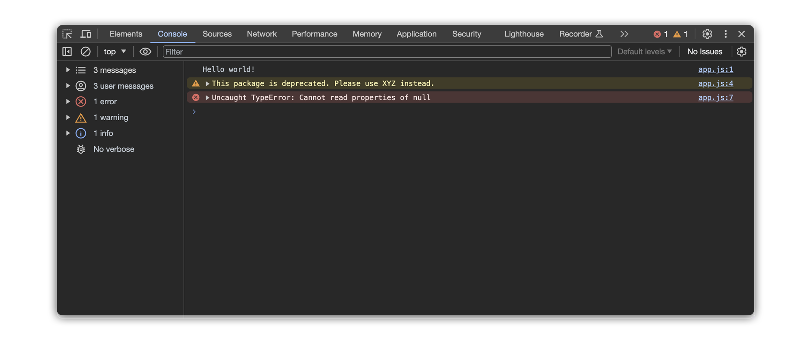

## Network tab

The Network Tab in Chrome DevTools is a helpful tool for examining network activity. It provides useful insights into the requests and responses exchanged between the browser and server. It shows everything your page loads, like pictures, videos, and stylesheets, as well as how long it takes these resources to load and if there were any errors along the way. 

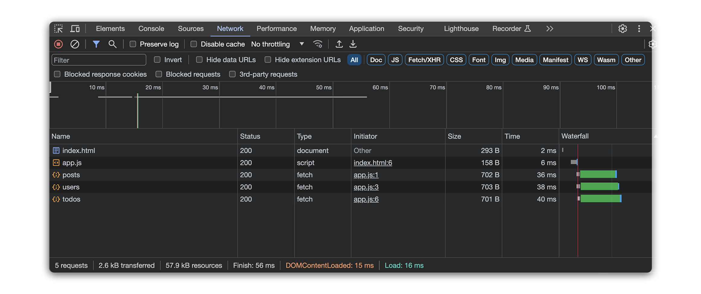

**Developers use it for:**

- **Performance analysis**: See what slows down your page, like large images or scripts, to make it load faster.

- **Request details**: Timestamp, URL, HTTP method (e.g., `GET`, `POST`), status code (e.g., `200 success`, `404 not found`), and requested resource type.

- **Debugging network issues**: Diagnose connection problems and other server errors that stop your page from working properly.

### Benefits of the network tab

- **Understanding website architecture**: Examining the flow of requests and responses reveals how a website interacts with servers and delivers content.

- **Learning web development**: Analyzing network traffic provides valuable insights into how websites are built and how data is transferred across the web.

## Devices panel

The Devices Panel in Chrome DevTools is like a digital playground for testing your webpages. It lets you see how your site looks and works on different devices, like phones and tablets.

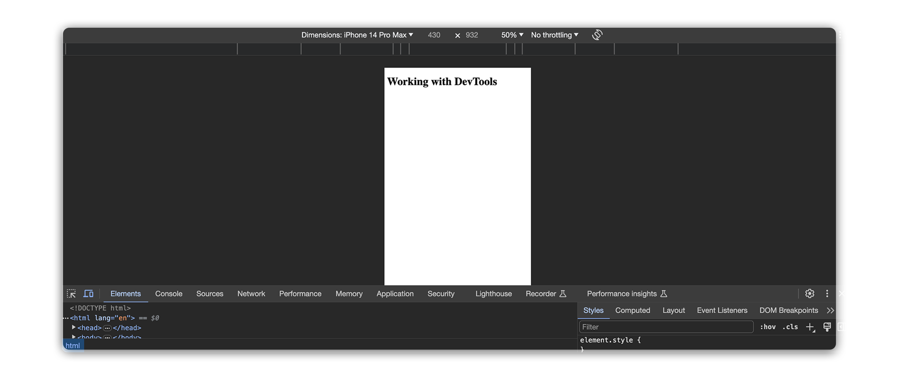 

**Developers use it for:**

- **Device emulation**: This emulator comes with a pre-defined library of popular smartphones, tablets, and desktops allows developers to select specific device profiles for simulation. Easily check if your webpage looks good on small phone screens, big desktop monitors, and everything in between.

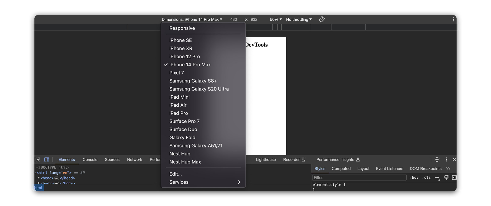

- **Orientation adjustment**: Portrait, landscape, and other device orientations can be emulated to see how the webpage layout adapts to different viewing angles. Make sure your site is easy to use no matter how people view it – whether they flip their phone sideways or use a tablet.

- **Responsive styling inspection**: Developers can analyze how media queries and other responsive design principles are implemented in the webpage's CSS.

### Benefits for testing

- **Element inspection**: Combined with the Elements panel, developers can pinpoint specific elements affected by responsive styling and fine-tune their properties to optimize the layout for different devices.

- **Touch interaction simulation**: Options to emulate tap, swipe, and pinch-to-zoom gestures assist in testing the functionality and user experience of touch-enabled elements on simulated mobile devices.

- **Ensuring accessibility**: Understanding how websites appear and function on various devices fosters empathy for users with different screen sizes and interaction preferences, guiding informed design decisions.